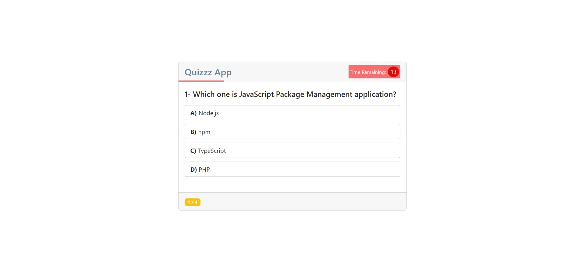
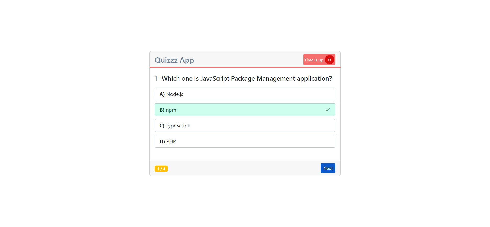
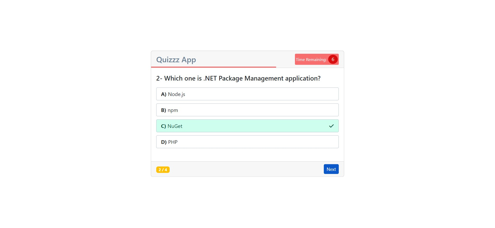
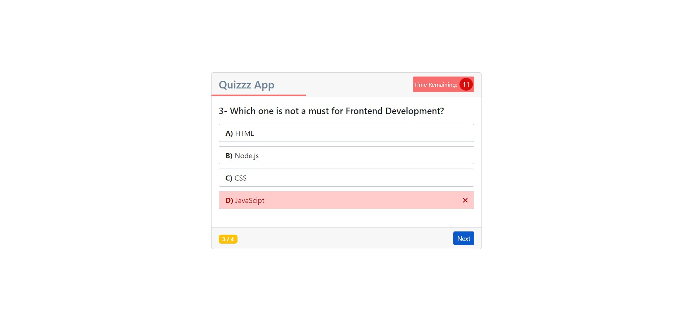
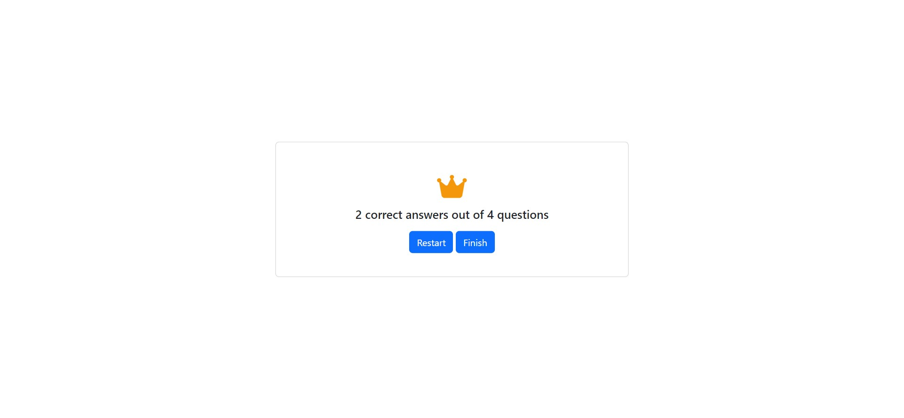

## QUIZZZ APP
The Quizzz App starts with "Start Quiz" button.

After Quizzz starts, you have 15 seconds to answer each questions.

If you don't select any of the choices, you will see "Time is up" information, the correct answer, and the "Next" button to see other question.

When you choose correct answer:

When you choose wrong answer:

You are able to see the score when the Quizzz ends. Moreover, you can restart or finish it by clicking the buttons.

### Used Technologies
- HTML
- CSS
- JavaScript

#### Check the Quizzz App:
[Click here!](https://quizzz-app-webdev.netlify.app/)
